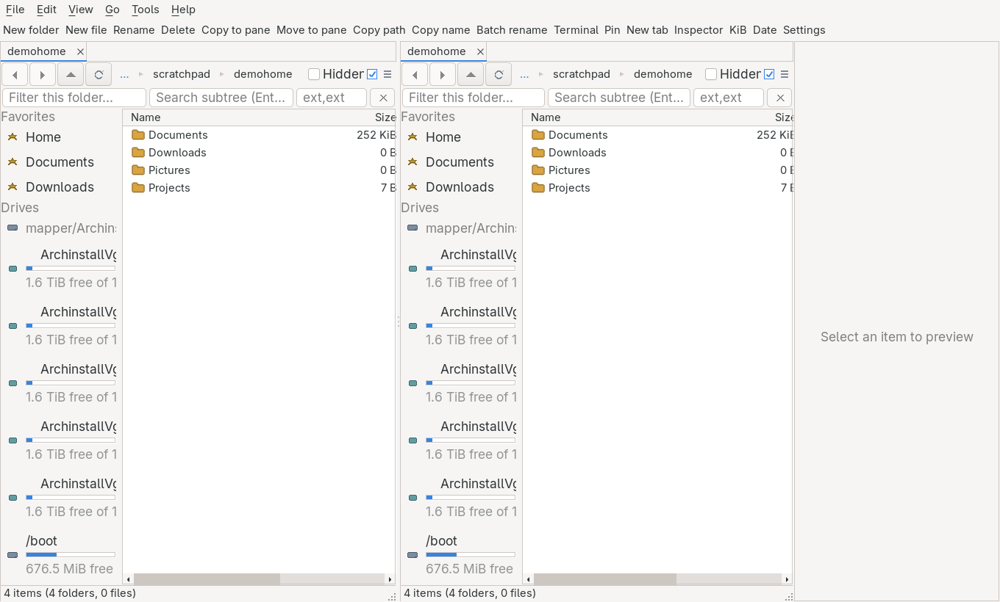
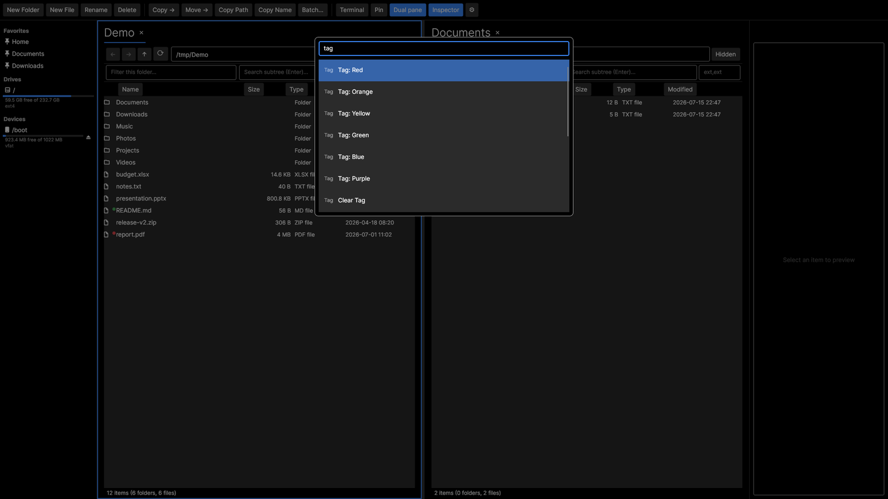

# foileBrowser

A fast, keyboard-first, cross-platform (Windows / Linux / macOS) file browser, inspired by [OneCommander](https://onecommander.com/) and [File Pilot](https://filepilot.tech/).

**Stack:** C# 14 · .NET 10 · [NativeForms](../NativeForms) (Win32/GTK via P/Invoke) · MVVM (CommunityToolkit.Mvvm) · NUnit

## Screenshots

> **Note:** the shots below still show the previous Avalonia front-end; they predate the
> NativeForms rebuild and need retaking.

Dual-pane browsing with per-pane tabs, color tags, an inspector panel, and a sidebar of
favorites, drives and removable devices:



Fuzzy command palette (`Ctrl+P`) — every action, searchable:



## Layout

- `src/` — application code
- `tests/` — NUnit tests
- `docs/` — documentation, including the [PRD](docs/PRD.md) and `screenshots/`

## Build & run

```sh
dotnet run --project src/FoileBrowser.csproj   # launch the app
dotnet test                                    # run the NUnit suite
dotnet build foileBrowser.slnx                 # build the whole solution
```

## Install

Installs a `foilebrowser` launcher (plus, on Linux, an icon and a menu entry that can be set
as the default file manager). No root required — it installs under `~/.local` by default.

```sh
# Linux / macOS
./install.sh                 # or: ./install.sh --prefix /usr/local --self-contained
./uninstall.sh
```

```powershell
# Windows (PowerShell)
./install.ps1                # or: ./install.ps1 -SelfContained
./uninstall.ps1
```

Without `--self-contained` the launcher runs on the installed .NET 10 runtime; with it, a
standalone **trimmed** build is published that needs no runtime and has the smallest footprint.

**Optional:** install `ffprobe` (from FFmpeg) to get the audio/video metadata columns — resolution,
fps, duration, channels, bitrate, codec. Without it those columns stay blank; image metadata columns
(dimensions, megapixels, channels, depth, colour count) need no extra tools.

**Memory:** there is no renderer to choose — the window and the text-bearing controls are real
platform widgets and everything else is painted straight onto them, so no GPU stack and no bundled
font are ever mapped in. Measured idle on one Linux/GTK (Wayland) desktop, published Release:
**131 MB RSS / 68 MB PSS / 47 MB private-dirty**, against 149 MB / 107 MB for the previous Avalonia
build on the same machine. PSS is the honest figure here — most of what remains is GTK and system
fonts the desktop already has resident. For the smallest footprint, build with `./install.sh --aot` (NativeAOT; needs `clang`) —
archive support is preserved via a compile-time source generator, so no runtime reflection is used.
See [docs/PRD.md](docs/PRD.md) §6.12 for the breakdown.

## Status

- **M0 — Scaffold** ✅ — repo layout, PRD, README
- **M1 — MVP browsing** ✅ — app shell, single virtualized pane, async directory
  listing, back/forward/up + editable path bar, column sorting, hidden-file toggle
- **M2 — Panes, tabs & operations** ✅ — dual pane + splitter, per-pane tabs, sidebar
  (favorites + drives with free-space), background copy/move queue, delete-to-trash,
  rename, new file/folder, copy path/name
- **M3 — Search, preview & palette** ✅ — as-you-type filter, recursive streaming fuzzy
  search with extension filters, inspector panel + spacebar quick-preview (text/image/folder),
  fuzzy command palette (Ctrl+P)
- **M4 — Polish** ✅ — font size + row density, portable JSON
  settings, session restore, color tags (filterable), batch rename (regex/counter/date tokens),
  filesystem-watcher auto-refresh, open-with / open-terminal-here
- **M5 — Devices & archives** ✅ — clean removable/GVfs device list with fs-type + eject and
  plug/unplug auto-refresh; sidebar context menu; opt-in disk formatting / filesystem creation
  (mkfs via pkexec, guarded by type-to-confirm); enter archives (ZIP/TAR/7z/… via CompressionWorkbench)
  as virtual folders, extract, nested descent, identify-format
- **M6 — Configurability** ✅ — rebindable hotkeys (live key capture + conflict detection), per-button
  toolbar show/hide, hideable search bar with Ctrl+F reveal — all in a tabbed Settings dialog
- **M7 — Native UI** ✅ — the whole view layer rebuilt on [NativeForms](../NativeForms): real
  platform windows, buttons and text fields, everything else painted in the desktop's own theme.
  The view-models, services and docking model were untouched. Theme variant and accent colour are
  gone as settings — the toolkit takes both from the desktop.

See [docs/PRD.md](docs/PRD.md) for the checkboxed feature list and milestones — check off what's
built, delete what's not wanted.
