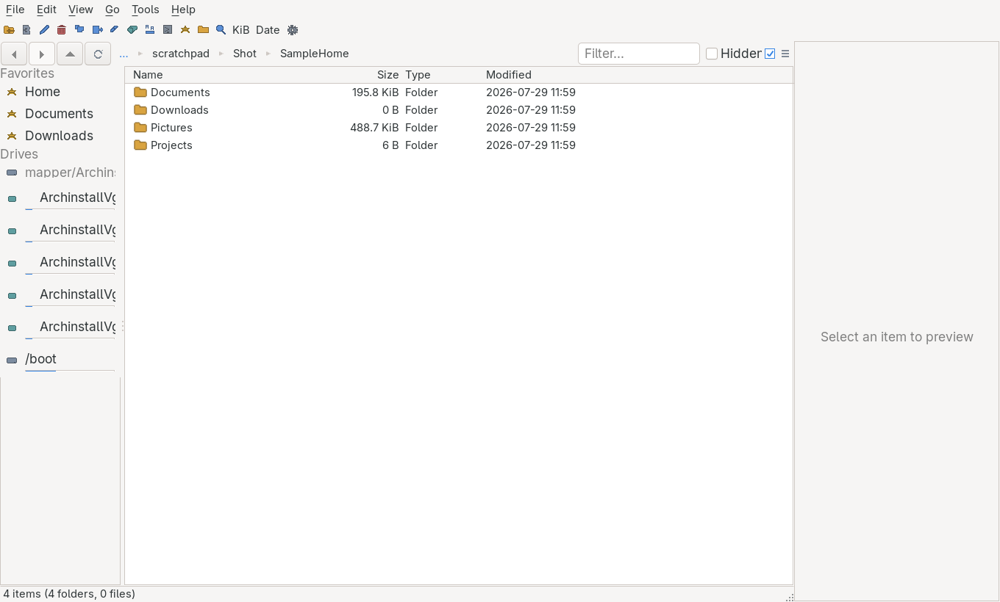
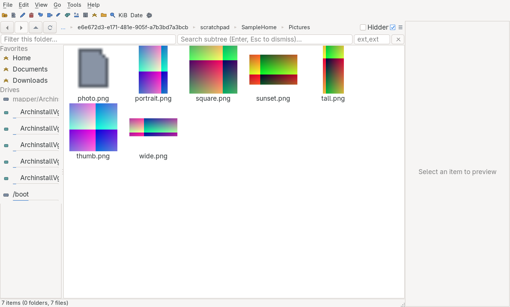

# 📂 foileBrowser

[](https://github.com/KsmBl/foileBrowser/blob/main/LICENSE)
[](https://github.com/KsmBl/foileBrowser)

[](https://github.com/KsmBl/foileBrowser/actions/workflows/ci.yml)


[](https://github.com/KsmBl/foileBrowser/stargazers)
[](https://github.com/KsmBl/foileBrowser/network/members)
[](https://github.com/KsmBl/foileBrowser/issues)


[](https://github.com/KsmBl/foileBrowser/releases/latest)
[](https://github.com/KsmBl/foileBrowser/releases)
[](https://github.com/KsmBl/foileBrowser/releases)

> A fast, keyboard-first file browser for Windows and Linux — multi panes, tabs, a fuzzy command
> palette, an inspector, colour tags and archives-as-folders — drawn with real platform widgets
> rather than a rendering engine, so it idles in a fraction of the memory a modern file manager
> takes. Inspired by [OneCommander](https://onecommander.com/) and [File Pilot](https://filepilot.tech/).

**Stack:** C# 14 · .NET 10 · [NativeForms](https://github.com/Hawkynt/NativeForms) (Win32/GTK via P/Invoke) · MVVM (CommunityToolkit.Mvvm) · NUnit

## 📸 Screenshots

A single pane on first run — a resizable sidebar of favorites, drives and removable devices, the
file list, and the inspector. Split it, tab it and arrange it from there:



Ctrl+G switches a pane to the gallery, for the folders where what a file looks like matters more
than its size and date:



The app photographs itself, so this can be regenerated anywhere:

```sh
dotnet run --project src/FoileBrowser.csproj -- --screenshot docs/screenshots/main-window.png
```

It composites the window through the toolkit's own draw pipeline rather than asking the desktop for
a grab, which is what makes it work on a headless or Wayland session where a screenshot tool gets
nothing. Add `--standalone` when an instance is already running, so the launch captures its own
window instead of handing the request over.

## 🧩 Layout

- `src/` — application code
- `tests/` — NUnit tests
- `docs/` — documentation, including the [PRD](docs/PRD.md) and `screenshots/`

## 🛠️ Build & run

The UI toolkit is a sibling repo consumed by project reference, not a package, so clone it next to
this one before building:

```sh
# Working directory layout the csproj's relative paths expect
work/
├─ foileBrowser/   # this repo
└─ NativeForms/    # the UI toolkit

git clone https://github.com/KsmBl/foileBrowser.git
git clone https://github.com/Hawkynt/NativeForms.git
```

```sh
cd foileBrowser

dotnet run --project src/FoileBrowser.csproj   # launch the app
dotnet test foileBrowser.slnx                  # run the NUnit suite
dotnet build foileBrowser.slnx                 # build the whole solution
```

On Linux the app needs GTK 3 at run time (`libgtk-3-0`); on Windows it needs nothing beyond the
.NET runtime, or nothing at all for a self-contained build.

## 🚀 Install

Installs a `foilebrowser` launcher (plus, on Linux, an icon and a menu entry that can be set
as the default file manager). No root required — it installs under `~/.local` by default.

```sh
# Linux
./install.sh                 # or: ./install.sh --prefix /usr/local --self-contained
./uninstall.sh
```

```powershell
# Windows (PowerShell)
./install.ps1                # or: ./install.ps1 -SelfContained
./uninstall.ps1
```

Without `--self-contained` the launcher runs on the installed .NET 10 runtime; with it, a
standalone **trimmed** build is published that needs no runtime and has the smallest footprint.

**Optional:** install `ffprobe` (from FFmpeg) to get the audio/video metadata columns — resolution,
fps, duration, channels, bitrate, codec. Without it those columns stay blank; image metadata columns
(dimensions, megapixels, channels, depth, colour count) need no extra tools.

**One process, every window.** Launching `foilebrowser <folder>` while it is already running hands
the folder to the copy already up and exits, rather than paying for a second runtime. Where it lands
is up to you (Settings ▸ Appearance): a **tab** in the current pane (default, +1 MB), a **pane** split
beside it, or its **own window** (+21 MB — still a fraction of the ~73 MB another process costs).
Closing any window closes only that window; the process ends with the last one. `--standalone` opts
out.

**Memory:** there is no renderer to choose — the window and the text-bearing controls are real
platform widgets and everything else is painted straight onto them, so no GPU stack, no rendering
engine and no bundled font are mapped in. Icons are drawn in code rather than typed as emoji, which
keeps the colour-emoji and CJK fallback fonts (20 MB between them) out of the process entirely.
SkiaSharp is still linked as an image decoder and loads only when a metadata column or a preview
meets a format the toolkit does not read itself.

Measured idle on one Linux/GTK (Wayland) desktop, published Release:

| Build                                          |       RSS |      PSS |
| ---------------------------------------------- | --------: | -------: |
| NativeForms                                    |     96 MB |    42 MB |
| NativeForms + NativeAOT (`./install.sh --aot`) | **73 MB** | 41–48 MB |

Against the neighbours, measured identically on the same folder and session:

| File manager           |       RSS |      PSS |
| ---------------------- | --------: | -------: |
| Thunar (GTK, C)        |     59 MB |    29 MB |
| **foileBrowser (AOT)** | **73 MB** | 41–48 MB |
| Dolphin (Qt/KDE)       |    153 MB |    51 MB |

So: under half of Dolphin's RSS and about level on PSS; Thunar is leaner than both. The ~14 MB
between us and Thunar is the .NET runtime itself — `ConserveMemory`, gen0 tuning and size-optimised
codegen were each measured and none moved it — so closing that gap means not having a managed
runtime. Windows Explorer isn't in the table because it can't be measured here; Wine ships its own
reimplementation, which would tell you nothing about Microsoft's.

PSS is the honest figure — most of what remains is GTK the desktop already has resident. What is
left in the AOT build is mostly the window's own surface buffer (11 MB) and the binary itself
(9 MB). AOT needs `clang` to build; archive support survives it via a compile-time source generator,
so no runtime reflection is used. See [docs/PRD.md](docs/PRD.md) §6.12 for the breakdown.

## 📋 Status

- **M0 — Scaffold** ✅ — repo layout, PRD, README
- **M1 — MVP browsing** ✅ — app shell, single virtualized pane, async directory
  listing, back/forward/up + editable path bar, column sorting, hidden-file toggle
- **M2 — Panes, tabs & operations** ✅ — dual pane + splitter, per-pane tabs, sidebar
  (favorites + drives with free-space), background copy/move queue, delete-to-trash,
  rename, new file/folder, copy path/name
- **M3 — Search, preview & palette** ✅ — as-you-type filter, recursive streaming fuzzy
  search with extension filters, inspector panel + spacebar quick-preview (text/image/folder),
  fuzzy command palette (Ctrl+P)
- **M4 — Polish** ✅ — font size + row density, portable JSON
  settings, session restore, color tags (filterable), batch rename (regex/counter/date tokens),
  filesystem-watcher auto-refresh, open-with / open-terminal-here
- **M5 — Devices & archives** ✅ — clean removable/GVfs device list with fs-type + eject and
  plug/unplug auto-refresh; sidebar context menu; opt-in disk formatting / filesystem creation
  (mkfs via pkexec, guarded by type-to-confirm); enter archives (ZIP/TAR/7z/… via CompressionWorkbench)
  as virtual folders, extract, nested descent, identify-format
- **M6 — Configurability** ✅ — rebindable hotkeys (live key capture + conflict detection), per-button
  toolbar show/hide, hideable search bar with Ctrl+F reveal — all in a tabbed Settings dialog
- **M7 — Native UI** ✅ — the whole view layer rebuilt on [NativeForms](../NativeForms): real
  platform windows, buttons and text fields, everything else painted in the desktop's own theme.
  The view-models, services and docking model were untouched. Theme variant and accent colour are
  gone as settings — the toolkit takes both from the desktop. Icons are drawn in code instead of
  typed as emoji, and idle RSS is halved (149 MB → 75 MB with NativeAOT).

See [docs/PRD.md](docs/PRD.md) for the checkboxed feature list and milestones — check off what's
built, delete what's not wanted.

## 🤖 CI

GitHub Actions, mirroring the layout every repo here uses:

| Workflow      | When                       | What                                                                                                        |
| ------------- | -------------------------- | ----------------------------------------------------------------------------------------------------------- |
| `ci.yml`      | push / PR to `main`        | tests on Linux, Windows and macOS; a GTK screenshot gate; a NativeAOT publish per RID                       |
| `nightly.yml` | after a green CI on `main` | builds that exact SHA, publishes a `nightly-yyyyMMdd` prerelease, prunes old ones, and reports idle RSS/PSS |
| `release.yml` | manual dispatch            | runs CI, builds, updates `CHANGELOG.md`, cuts a dated `vyyyyMMdd` release                                   |
| `_build.yml`  | called by the two above    | the single place a commit turns into artifacts, so release and nightly cannot diverge                       |

Both workflows that build check out **NativeForms beside this repo**, because the toolkit is consumed
by project reference rather than as a package.

The screenshot job is a gate, not decoration. The unit tests only reach view-models and services;
that job is the first and only place the whole view layer is put on screen, and the first shot taken
this way found a file list drawing no icons at all, mirrored back/forward arrows, and sidebar rows
clipping their own captions — none of which any unit test could see.

Version stamping is `.github/workflows/scripts/version.pl --stamp`, which appends the commit count to
the `<Version>` in `Directory.Build.props`. Versions come from files, never from a git tag.

## ❤️ Support

If this project saves you time or money, consider supporting its development:

[](https://github.com/sponsors/KsmBl)
[](https://www.paypal.me/WhisperUwU)

## 📜 License

Licensed under LGPL-3.0-or-later — see [LICENSE](LICENSE).
