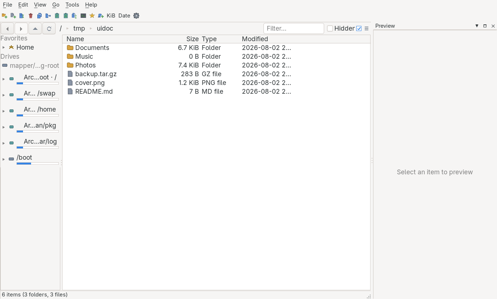
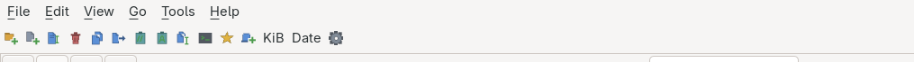
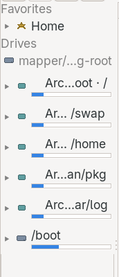
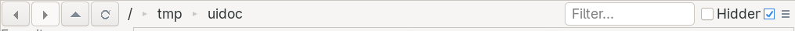
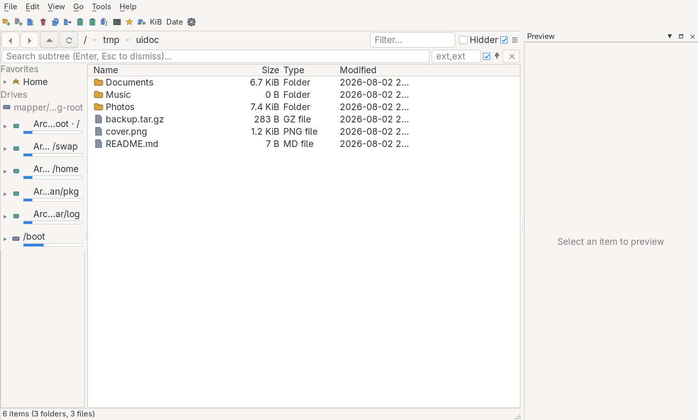
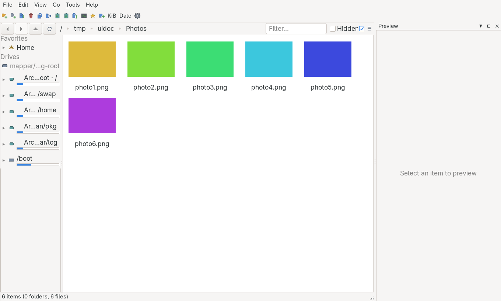
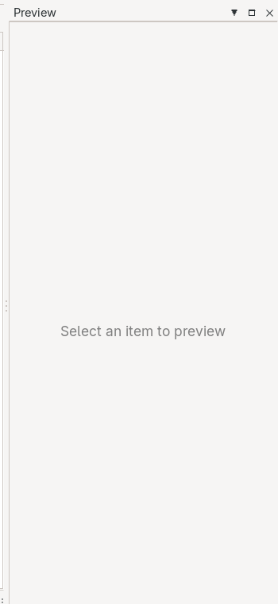

# foileBrowser — the parts of the window, and what they are called

A map of the interface, so that "the filmstrip drops the last thumbnail" says exactly one thing and
lands in exactly one place. Every name in **bold** is the name to use; the code column says where it
lives if you want to look.

Screenshots are of the real window (captured with `--screenshot`), not mock-ups.

---

## 1. The look, and what it is for

foileBrowser is a **fast, keyboard-first file browser** — see [PRD §1](PRD.md). Two influences, on
purpose: the organised, dense chrome of OneCommander (panes, tabs, tags, real columns) and the
instant feel of File Pilot (everything reachable from the keyboard, nothing that makes you wait).

Five things it is trying to be, in the order they matter:

1. **Instant.** A folder appears when you ask for it. Nothing blocks on counting, decoding or
   thumbnailing — those arrive later and the row updates in place. 100k entries must not stutter.
2. **Keyboard-complete.** The mouse is optional and never required. Anything on the toolbar is on a
   menu, and anything on a menu has a key.
3. **Dense but legible.** Real columns, small padding, no decoration that costs a row. A tile in the
   nav pane is four pixels of padding, not eight, because it is multiplied by every volume.
4. **Native, not painted-native.** Platform widgets where the platform has one, owner-drawn where it
   does not — never a whole toolkit's worth of custom chrome.
5. **Honest about work in progress.** A value that is not known yet shows as `…` and fills in; it
   never shows a wrong number that quietly corrects itself.

Look and feel: the system theme's colours and font, one accent colour, icons drawn in code (never
emoji — a font lookup for a picture costs 20 MB of resident memory). Nothing animates except what
the platform animates.

---

## 2. The whole window



```
┌──────────────────────────────────────────────────────────────────────────────────────┐
│ File  Edit  View  Go  Tools  Help                                        ① MENU BAR  │
├──────────────────────────────────────────────────────────────────────────────────────┤
│ 🗀+ 🗎+ 🗎✎ 🗑 ⧉ ➜ 📋 📋 🗎✎ ▪ ★ 🗂+  KiB  Date  ⚙                       ② TOOLBAR   │
├───────────────┬──────────────────────────────────────────────┬───────────────────────┤
│               │ ◀ ▶ ▲ ⟳ │ / ▸ tmp ▸ uidoc │ Filter… │☐Hidden ≡ │  ④ PATH BAR         │
│               ├──────────────────────────────────────────────┤                       │
│  ③ NAV PANE   │ Name          Size    Type     Modified      │   ⑥ INSPECTOR         │
│               │ ─────────────────────────────────────────────│                       │
│  Favorites    │ 🗀 Documents  6.7 KiB Folder   2026-08-02     │   (Preview panel)     │
│  ▸ ★ Home     │ 🗀 Music        0 B   Folder   2026-08-02     │                       │
│  Drives       │ 🗀 Photos     7.4 KiB Folder   2026-08-02     │                       │
│  ▸ ▭ Arch…/   │ 🗎 backup.tar.gz 283 B GZ file 2026-08-02     │                       │
│    ▁▁▁▁       │ 🗎 cover.png   1.2 KiB PNG     2026-08-02     │                       │
│  ▸ ▭ Arch…    │ 🗎 README.md     7 B  MD file  2026-08-02     │                       │
│               │                                              │                       │
│               │              ⑤ FILE LIST                     │                       │
├───────────────┴──────────────────────────────────────────────┴───────────────────────┤
│ 6 items (3 folders, 3 files)                                          ⑦ STATUS BAR   │
└──────────────────────────────────────────────────────────────────────────────────────┘
```

| # | Name | What it is | Code |
|---|------|-----------|------|
| ① | **menu bar** | File / Edit / View / Go / Tools / Help. Every command lives here; the toolbar and keys are shortcuts to it. | `MainForm.Menu.cs` |
| ② | **toolbar** | Global file operations. Configurable: Settings → Toolbar reorders and hides buttons. | `MainForm.Menu.cs` → `RebuildToolbarItems` |
| ③ | **nav pane** | Favourites, drives, devices — each row expandable into its folders. | `SidebarView.cs` |
| ④ | **path bar** | The navigation row: back/forward/up/refresh, breadcrumb, filter box, hidden toggle, pane menu. | `PaneView.cs` |
| ⑤ | **file list** | The listing itself. Also called the **details view** when showing columns. | `FileGridView.cs` |
| ⑥ | **inspector** | The preview panel on the right. Dockable, closable, `Ctrl+I`. | `PreviewPane.cs` |
| ⑦ | **status bar** | Item counts on the left, selection summary when something is selected. | `PaneView.cs` |

**Pane** = ③④⑤⑦ together — one folder view with its own history and tabs. The window can hold several.

---

## 3. The toolbar and menu bar



Left to right, the toolbar's default buttons:

| Icon | Name | Does |
|---|---|---|
| folder + green **+** | **new folder** | Creates a folder here (`Ctrl+Shift+N`) |
| page + green **+** | **new file** | Creates an empty file |
| page + caret | **rename** | Renames the selection (`F2`) |
| red bin | **delete** | To the trash (`Delete`) |
| two pages | **copy to other pane** | `F6` |
| page + arrow | **move to other pane** | `F7` |
| clipboard + slashes | **copy path** | Full path to the clipboard |
| clipboard + **A** | **copy name** | Just the name |
| pages + caret | **batch rename** | Rename many at once |
| dark screen | **terminal here** | Opens a shell in this folder |
| star | **pin** | Pins the current folder to Favourites |
| tab + green **+** | **new tab** | `Ctrl+T` |
| `KiB` | **size unit** | Cycles KiB → KB → bytes. Shows the current one. |
| `Date` | **date format** | Cycles absolute ↔ relative. Shows the current one. |
| gear | **settings** | Opens Settings |

The last two are the only buttons that carry state rather than an action — that is why they are text
and not a picture, and why they stayed when the inspector toggle was dropped for duplicating a
View-menu entry.

---

## 4. The nav pane



```
Favorites            ← section header
▸ ★ Home             ← favourite row, with its twisty
Drives               ← section header
  ▭ mapper/…-root    ← disk group (a label; not clickable)
▸ ▭ Arch…oot · /     ← volume row  ┐
   ▁▁▁▁▁▁▁▁▁▁        ←  usage bar  ┘ together: a drive tile
▸ ▭ Arch… /home
▸ ▭ /boot
```

| Name | What it is |
|---|---|
| **section header** | "Favorites", "Drives", "Devices". Right-click to reorder or hide the section. |
| **favourite row** | A pinned folder. |
| **drive tile** | A volume: caption, usage bar, and free-space line when there is room. |
| **disk group** | A physical disk labelling the partitions under it. Not navigable. |
| **twisty** | The `▸`/`▾` triangle. Opens the row into its own folders, in place. |
| **folder row** | A folder revealed by opening a twisty, indented by depth. |

The nav pane and the folder tree are **one thing** — there is no separate tree box. Clicking a row
goes there; clicking its twisty opens it without going there.

---

## 5. The path bar



| Name | What it is |
|---|---|
| **back**, **forward** | History. Also the mouse's thumb buttons. |
| **up** | To the parent. Also `Backspace`. |
| **refresh** | Re-reads the folder. |
| **breadcrumb** | The path as clickable segments. Click a segment to go there; click the chevron *between* two to drop down that folder's children; click the empty space to type a path. |
| **filter box** | Narrows the listing as you type. Does not navigate and does not search subfolders. |
| **hidden toggle** | Shows dotfiles. |
| **pane menu** (`≡`) | Per-pane options. |

### The search bar



A second row appears under the path bar on `Ctrl+F`, or always when pinned:

| Name | What it is |
|---|---|
| **search box** | Searches the whole subtree, not just this folder. Enter runs it, Escape dismisses it. |
| **extension filter** | `png,jpg` — restricts the search to those types. |
| **pin** | Keeps the search bar visible instead of dismissing it. |
| **stop** (`×`) | Cancels a running search. |

**Filter ≠ search.** The filter narrows what is already listed, instantly. The search walks the
subtree and streams hits in.

---

## 6. The file list

Two view modes for the same folder:

**Details view** — columns, sortable by clicking a header, reversible by clicking again.

| Name | What it is |
|---|---|
| **column header** | Click to sort. Drag the divider to resize; drag the header to reorder. |
| **row** | One entry. The leading stripe is its **colour tag**. |
| **rubber band** | Drag from empty space to select a run. |
| **type-ahead** | Typing letters jumps to the next matching name. |

**Gallery view** (`Ctrl+G`) — thumbnails with names underneath.



Selection follows the usual rules: click replaces, `Ctrl`+click adds, `Shift`+click takes the run
between, clicking empty space below the rows clears, clicking one of several selected rows narrows
to it.

---

## 7. The inspector



```
┌──────────────────────────────┐
│ Preview            ▾ ▫ ✕     │ ← dock caption
│ photo3.png                   │ ← title line
│ 1.2 KB · PNG file · 2026-…   │ ← info line
│ ◀ ▶   3 / 6  │ Fit ▾ │ 100%  │ ← control strip
├──────────────────────────────┤
│                              │
│         (the picture)        │ ← preview surface
│                              │
├──────────────────────────────┤
│  ▪  ▪  ▪  ▪                  │ ← filmstrip
└──────────────────────────────┘
```

| Name | What it is |
|---|---|
| **dock caption** | The panel's own title bar: collapse, float, close. |
| **title line** / **info line** | The name, then size · type · modified. |
| **control strip** | Previous/next, the **position counter** (`3 / 6`), the **scale mode** box, the **zoom readout**. |
| **preview surface** | The picture, pannable and zoomable; or the text; or a folder's listing. |
| **filmstrip** | Thumbnails of the other pictures in play. Click one to jump to it. |

The inspector shows the **selection**, not the folder. Select one picture and the rest of its folder
becomes the filmstrip; select a folder and its pictures do. Scale modes are Fit, Actual size, Fit
width, Fit height.

---

## 8. Vocabulary for reporting

Say **which part**, **what you did**, **what happened**. For example:

> *"In the **nav pane**, clicking a **twisty** on a volume opens it, but the **folder rows** underneath
> do not indent past the second level."*

> *"The **filmstrip** shows the pictures in the wrong order — the **position counter** says 4/6 for the
> third photo."*

Names worth having straight, because they are easy to mix up:

- **filter box** (narrows this folder) vs **search box** (walks the subtree)
- **nav pane** (left) vs **inspector** (right)
- **details view** vs **gallery view** — both are the **file list**
- **drive tile** (a row in the nav pane) vs **row** (a line in the file list)
- **pane** (one folder view) vs **tab** (one folder inside a pane) vs **window**

---

## 9. Known rough edges

Things already known, so they need not be reported again:

| Area | What is wrong |
|---|---|
| **tabs** | Each tab is not yet its own dockable element; the panes are laid out by the app rather than by the dock. |
| **tabs** | `Ctrl+W` does not close a tab — the command works, the key does not reach it. |
| **dual pane** | The `IsDualPane` setting does not bring up a second pane on its own; the saved layout wins. |
| **drag and drop** | Dropping onto a folder is not covered by the automated walkthrough — GTK carries the drop over its own protocol, which the harness cannot synthesise. |
| **rename** | `F2` opens a modal dialog the automated walkthrough cannot dismiss, so it is not machine-checked. |
| **toolbar** | The **rename** and **batch rename** icons are nearly the same picture at 24 px — a page with a caret, twice. |

The automated walkthrough (`--autopilot`) drives 30 gestures through the real toolkit and is the
first thing to run after a change to any of this.
